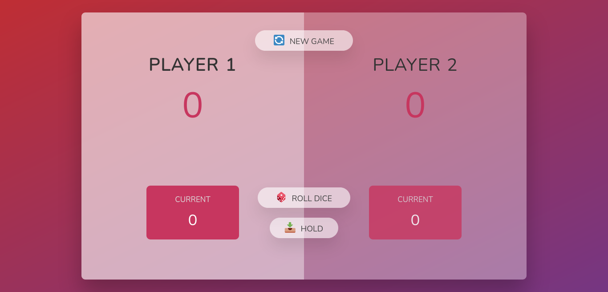
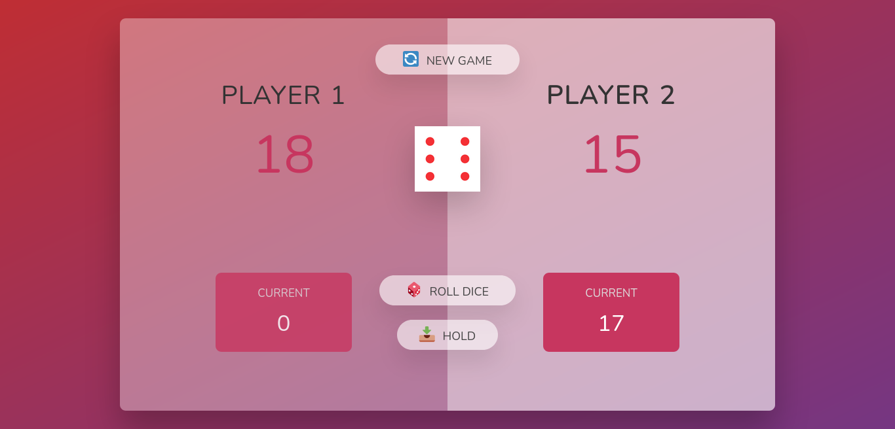
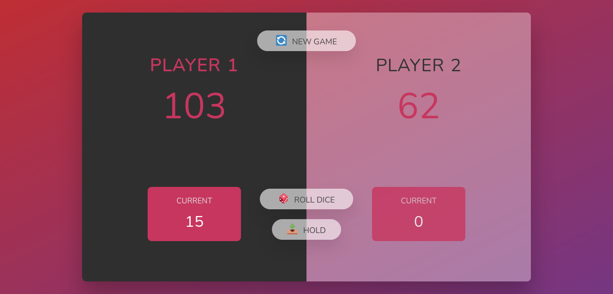

# Pig game - Udemy project

## Welcome! 👋

Thank you for checking out this project!!

This project was part of a course on Udemy, more specifically [Jonas Schmedtmann's Javascript course on Udemy](https://www.udemy.com/course/the-complete-javascript-course/). If you're interested, make sure to check it out!

## The project

The project was to build a game using what Javascript and DOM manipulation. Most part of the project you do it with Jonas during the lectures. In this project I plan to do a few thing yet, just to make it a bit closer to what I would have done.

## How the game works?

The game is very simple. There are two players, each one will have their chance to roll the dice and get some points. Every game begins the player one will be the first to roll the dice. If he gets any number, except for 1, the number he got on the dice will go to his current points. He can either hold this points, which will save them in his total points, or roll the dice again to try and get more points. But if he rolls 1, he will lose all of his points and the program will switch to the next player, which will have the same conditions to play.

## Where can I play the game?

You can play the game here: [https://vitoralves2c.github.io/dice-game/](https://vitoralves2c.github.io/dice-game/)

## Screenshots

## Feedback

If you have any feedback on the game, feel free to reach me at dev.vitoralves2c@outlook.com.

**Have fun!** 🚀
